# FinOps for AI Decision Tree 🚀
This framework helps organizations establish accurate AI budget forecasts and review processes by guiding the right stakeholders to ask the right questions at each stage of the budgeting lifecycle. I'm currently testing this logic flow and welcome feedback! 
### The Framework logic:

```mermaid
graph TD
    Start[Have a new AI POC?] --> Phase1[Phase 1: Preparation & Inputs]
    
    Phase1 --> Q1_1{Do we have historical<br/>AI cost data?}
    Q1_1 -->|NO| A1_1[Establish baseline tracking<br/>- Implement tagging<br/>- Set up cost allocation<br/>- Wait 30-60 days]
    Q1_1 -->|YES| Q1_2[Identify Usage Drivers<br/>Engineering Question]
    
    Q1_2 --> A1_2[Document:<br/>- Training costs<br/>- Inference costs<br/>- Data storage<br/>- Infrastructure]
    A1_2 --> Q1_3[Assess Business Drivers<br/>Product Question]
    
    Q1_3 --> A1_3[Create matrix:<br/>- Adoption targets<br/>- Feature launches<br/>- Geographic expansion<br/>- Marketing campaigns]
    A1_3 --> Q1_4[Collect Engineering Forecast]
    
    Q1_4 --> A1_4[Document:<br/>- Retraining frequency<br/>- New deployments<br/>- Architecture changes<br/>- Optimization plans]
    A1_4 --> Q1_5[Define Finance Constraints]
    
    Q1_5 --> A1_5[Document:<br/>- Quarterly limits<br/>- Growth expectations<br/>- Approval thresholds<br/>- Variance tolerance]
    A1_5 --> Phase2[Phase 2: Budget Design & Allocation]
    
    Phase2 --> Q2_1{How should budgets<br/>be allocated?}
    Q2_1 -->|By Team| A2_1a[Assign budget owners<br/>per team]
    Q2_1 -->|By Product| A2_1b[Assign budget owners<br/>per product]
    Q2_1 -->|By Workload| A2_1c[Separate training,<br/>inference, experimentation]
    Q2_1 -->|Hybrid| A2_1d[Combination approach]
    
    A2_1a --> Q2_2[Define Budget Segmentation]
    A2_1b --> Q2_2
    A2_1c --> Q2_2
    A2_1d --> Q2_2
    
    Q2_2 --> A2_2[Create breakdown:<br/>- Training workloads<br/>- Inference workloads<br/>- Supporting infrastructure]
    A2_2 --> Q2_3{Set experimentation<br/>buffer percentage?}
    
    Q2_3 -->|10-20% recommended| A2_3[Reserve budget with<br/>clear usage guidelines]
    A2_3 --> Q2_4[Define Shared Cost Allocation]
    
    Q2_4 --> A2_4[Allocate by:<br/>- Usage metrics<br/>- GPU hours<br/>- Storage volume]
    A2_4 --> Phase3[Phase 3: Review & Collaboration]
    
    Phase3 --> Q3_1{Are budget<br/>assumptions realistic?}
    Q3_1 -->|NO| A3_1a[Revise assumptions<br/>with stakeholders]
    Q3_1 -->|YES| Q3_2{Do costs match<br/>expected activity?}
    
    A3_1a --> Q3_2
    Q3_2 -->|NO| A3_2a[Document gaps<br/>requiring adjustment]
    Q3_2 -->|YES| Q3_3[Set Variance Thresholds]
    
    A3_2a --> Q3_3
    Q3_3 --> A3_3[Define zones:<br/>Green: Within ±10%<br/>Yellow: ±10-20%<br/>Red: >±20%]
    A3_3 --> Q3_4{Are there predictable<br/>cost spikes?}
    
    Q3_4 -->|YES| A3_4[Flag spikes and get<br/>Finance pre-approval]
    Q3_4 -->|NO| Phase4[Phase 4: Execution & Monitoring]
    A3_4 --> Phase4
    
    Phase4 --> Q4_1[Setup Real-Time Monitoring]
    Q4_1 --> A4_1[Implement:<br/>- Daily spend dashboards<br/>- Budget vs actual<br/>- Unit cost trends<br/>- Anomaly alerts]
    
    A4_1 --> Q4_2{Is spending<br/>tracking to budget?}
    Q4_2 -->|YES| A4_2a[Continue monitoring]
    Q4_2 -->|NO - Higher| Q4_3{Is usage higher<br/>than planned?}
    
    Q4_3 -->|YES| Q4_4{Is increased usage<br/>business driven?}
    Q4_3 -->|NO| A4_3[Investigate efficiency:<br/>- Model optimization<br/>- Right-sizing<br/>- Caching strategies]
    
    Q4_4 -->|YES - Expected| A4_4a[Update forecast<br/>Request budget increase]
    Q4_4 -->|YES - Unexpected| A4_4b[Assess sustainability<br/>Adjust or optimize]
    Q4_4 -->|NO| A4_4c[Investigate root cause:<br/>inefficiency, errors, misuse]
    
    A4_4a --> Q4_5{Should we adjust<br/>budget mid-period?}
    A4_4b --> Q4_5
    A4_4c --> Q4_5
    A4_3 --> Q4_5
    
    Q4_5 -->|YES - Triggers met| A4_5[Follow adjustment<br/>approval process]
    Q4_5 -->|NO| A4_2a
    A4_5 --> Phase5[Phase 5: Review & Continuous Improvement]
    A4_2a --> Phase5
    
    Phase5 --> Q5_1[Analyze Actual vs Forecast]
    Q5_1 --> A5_1[Complete variance analysis:<br/>- By category<br/>- Root causes<br/>- Impact assessment]
    
    A5_1 --> Q5_2{Which assumptions<br/>were incorrect?}
    Q5_2 --> A5_2[Document lessons:<br/>- Adoption rates<br/>- Optimization impact<br/>- Seasonal patterns<br/>- Unit costs]
    
    A5_2 --> Q5_3[Identify Process Improvements]
    Q5_3 --> A5_3[Evaluate:<br/>- Forecast accuracy<br/>- Owner engagement<br/>- Monitoring effectiveness<br/>- Communication cadence]
    
    A5_3 --> Q5_4[Review Holdback Fund Usage]
    Q5_4 --> A5_4[Analyze:<br/>- Deployment reasons<br/>- Remaining balance<br/>- Strategy effectiveness]
    
    A5_4 --> Q5_5[Refine Forecasting Models]
    Q5_5 --> A5_5[Update methodology:<br/>- New cost drivers<br/>- Seasonal factors<br/>- Unit cost assumptions<br/>- Business correlations]
    
    A5_5 --> End[Next Budget Cycle]
    End --> Phase1
    
    style Start fill:#e1f5ff
    style Phase1 fill:#fff4e1
    style Phase2 fill:#fff4e1
    style Phase3 fill:#fff4e1
    style Phase4 fill:#fff4e1
    style Phase5 fill:#fff4e1
    style End fill:#e1f5ff

```

